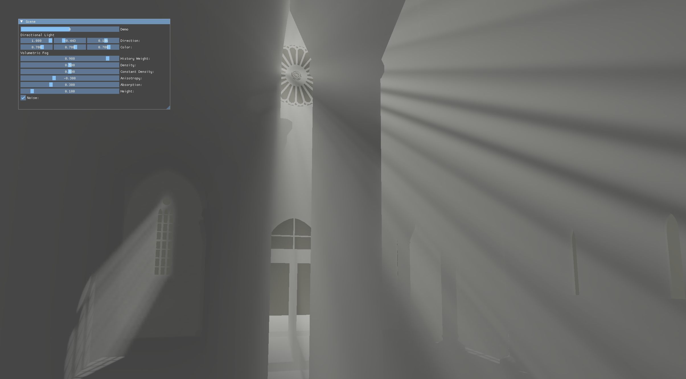
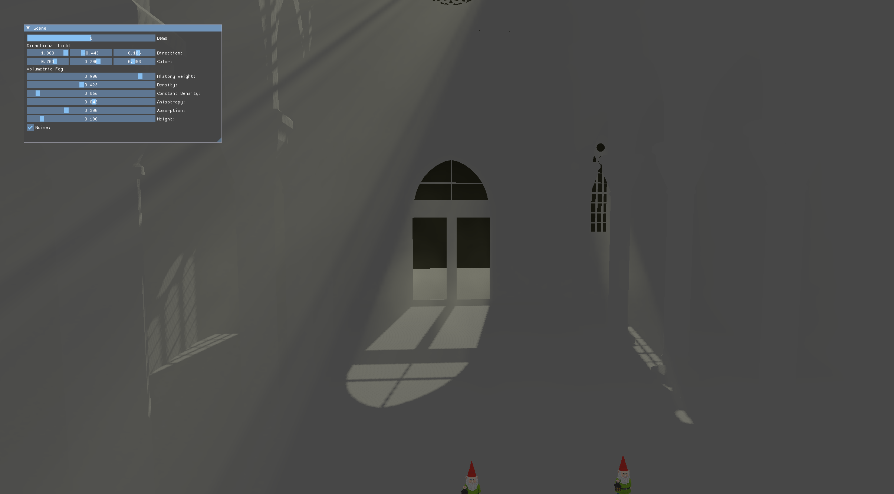

# About
This is an implementation of the volumetric fog technique pioneered by [Bart Wronski](https://github.com/bartwronski/CSharpRenderer).
Improved quality at a low sampling rate is achieved by temporal reprojection.




# Build & Run
**&#x26A0; This repository currently can't be built without internal access to TUM's gitlab, which hosts chair I15's TGA Vulkan library. We might migrate to pure Vulkan, when we get to it. &#x26A0;**

After cloning the repository for the first time, run:
```
git submodule update --init --recursive
```
To build, run:
```
cmake -B build/
cmake --build build/
```
After the build is completed, the executible will be at `build/src/fog` and can be run from the repository root as:
```
./build/src/fog -c build/src
```
or
```
cd build/src && ./fog
```
The argument is required to allow the binary to find the assets.

# Acknowledgements
This work is based on [Bart Wronski's](https://github.com/bartwronski/CSharpRenderer) volumetric fog. The shaders `volumetric_fog_raymarch.comp`, `volumetric_fog.comp` and `volumetric_fog_util.h` are based on his work.
